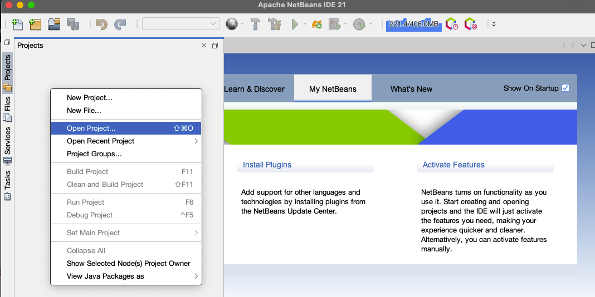
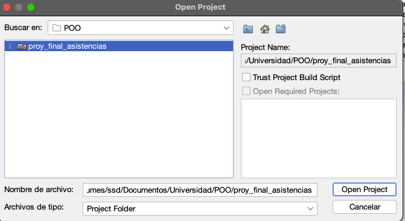
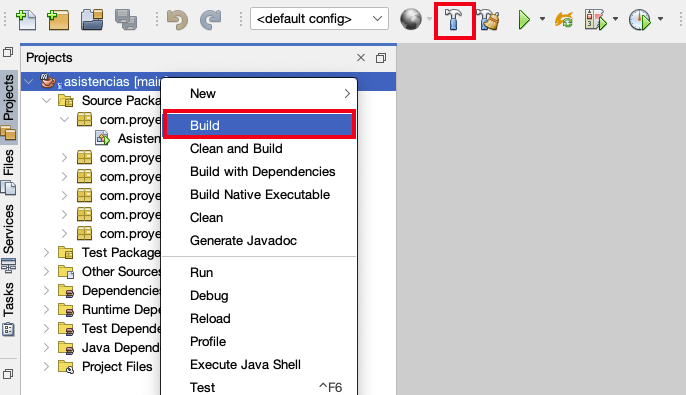
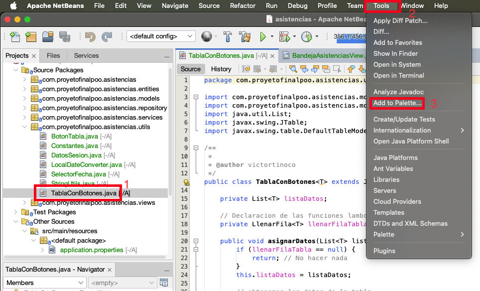

# Detalles del proyecto

Este proyecto es una base para realizar una aplicación de escritorio en java y con conexión a base de datos. Las technologies usadas son:

 - Java 21
 - Spring boot
 - Maven
 - Swing
 - SQLite como base de datos (configurable)

Tambien se hace uso de bibliotecas como Lombok y QueryDSL

# Requisitos
 - Tener instalado el JDK 21
 - Tener instalado Netbeans desde la versión 21 en adelante
# Configuración en Netbeans

 1. Clonar o descargar el zip y abrir el proyecto en netbeans (recomendado la version 21 en adelante)
 
 

 2. Hacer click derecho en el proyecto y seleccionar la opción build o dar click al boton del martillo
 

 3. Abrir el Archivo **TablaConBotones.java** dentro de la carpeta */utils* luego seleccionar Tools y Add to palette
 

 4. Seleccionar Swing Containers y darle al botón de OK
 

 5. Volver a realizar el paso 3 y 4 pero ahora con el archivo **SelectorFecha.java**

 6. Ejecutar el archivo AsistenciasApplication.java

# Estructura del proyecto

Se recomienda seguir la siguiente estructura al momento de organizar los archivos
 - En la carpeta */entities* deben estar todas las clases que son el mapeo de las tablas en base de datos. Estas deben tener la anotacion **@Entity**.
 - En la carpeta */repository* agregar las interfaces de cada Entidad mapeada, esto para que spring con JPA genere las consultas SQL esenciales. Cada interface debe tener el **@Repository** para aplicar la inyección de dependencias
 - En la carpeta */services* crear Todos los archivos que tienen la lógica de negocio de cada entidad, esto para separar el código y hacerlo reutilizable. Cada clase debe tener el **@Service** para aplicar la inyección de dependencias y de preferencia heredar la interface CrudBase.
 - En la carpeta */views* deben estar todos los formularios/pantallas que tendrá tu aplicación. Cada clase debe tener el **@Component** para aplicar la inyección de dependencias y de preferencia heredar la interface *BaseView*.
 - En la carpeta */utils* agregar todas las clases que tengan funciones estáticas reutilizables o constantes
 - En la carpeta */models* agregar cualquier otra clase, interface, record o enum que se necesite.

En la carpeta ***resources/db*** podemos encontrar 2 archivos:

- En el archivo ***schema.sql*** se pondrá (de forma opcional) todo el código SQL para la creación de las tablas. Este solo se ejecuta si la base de datos SQLite no existe.
- En el archivo ***data.sql*** se pondrá todo el código SQL para insertar datos. Este solo se ejecuta si la base de datos SQLite no existe.

Finalmente en el archivo **application.properties** se pueden encontrar las configuraciones de Spring donde podemos configurar la conexión a la base de datos
